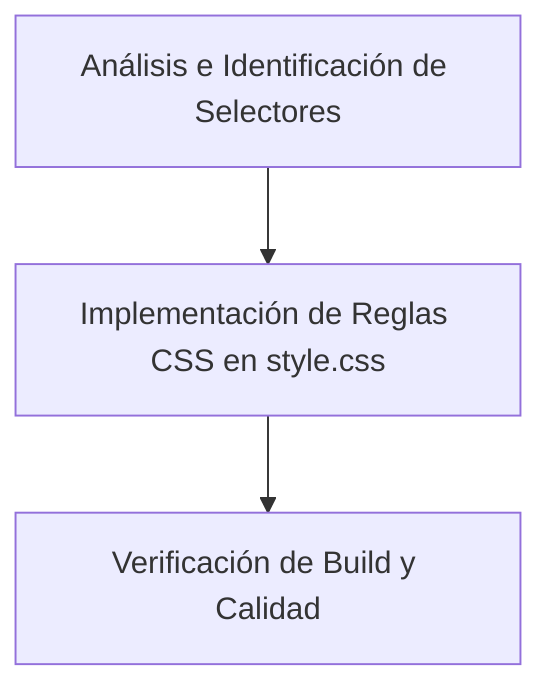

# Plan: Scrollbar Global Fina y Estilo Overlay responsiva

Este plan detalla la implementación de una barra de desplazamiento (scrollbar) global más fina, traslúcida y que funcione en modo "overlay" (sin robar ancho de pantalla ni causar saltos de diseño/layout shifts). Incorpora un efecto de auto-hide (atenuación) y respeta las scrollbars internas ya definidas en las tablas del Panel de Administración (`/admin`).

---

## 🛠️ Descripción General del Proyecto

* **Tipo de Proyecto**: WEB (SPA)
* **Arquitectura**: TypeScript + Vite + Tailwind CSS v4 + Flowbite
* **Propósito del Cambio**: Mejorar la armonía visual y estética premium en pantallas táctiles y escritorios, logrando que el viewport global y las áreas generales no se encojan con scrollbars gruesas nativas.

---

## 🎯 Criterios de Éxito

1. **Diseño Overlay (No-intrusivo)**: La barra de desplazamiento flota sobre el contenido sin desplazar ni robar ancho al viewport o contenedor (`overflow-y: overlay` en Webkit y `scrollbar-gutter: auto`).
2. **Dimensionamiento Fino**: El grosor de la scrollbar global en navegadores Chromium/Webkit es de un máximo de `8px` (con un área activa interna del "thumb" de `4px` tras el padding de recorte).
3. **Efecto Auto-hide / Hover**: El tirador (thumb) de la barra se ve muy sutil por defecto (baja opacidad de `0.2` o `0.25`) y se ilumina suavemente (`0.5` o `0.6`) al pasar el cursor por encima (`hover`).
4. **Respeto a Vista Admin**: Las scrollbars internas personalizadas existentes en `/admin` (de categorías, usuarios y tareas) permanecen intactas y funcionales.
5. **Doble Tema (Claro / Oscuro)**: Los colores de la barra cambian automáticamente según el tema del sistema/app (`slate-400` en tema claro y `slate-500` o `indigo` suave en oscuro).
6. **Compilación Limpia**: Cero errores de TypeScript y validación exitosa de toda la suite de control de calidad.

---

## 🔧 Pilas Tecnológicas y Decisiones de Diseño

* **Plugin base**: `tailwind-scrollbar` (ya integrado en `@import 'tailwindcss';` como plugin).
* **Base CSS**: Personalización con propiedades nativas combinadas con directivas `@layer base` en `src/style.css` para aplicar estilos a `html` y `body`.
* **Clases Utilizadas**:
  * Para Chromium/Webkit: pseudo-elementos `::-webkit-scrollbar`, `::-webkit-scrollbar-track` y `::-webkit-scrollbar-thumb`.
  * Para Firefox y Estándares: `scrollbar-width: thin` y `scrollbar-color`.

---

## 📁 Estructura de Archivos Afectados

Solo se requiere la edición de un único archivo central de estilos globales:
* 📝 [style.css](file:///c:/Users/pablo/OneDrive%20-%20Consejer%C3%ADa%20de%20Educaci%C3%B3n/Clase/Proyecto/todolist/frontend/src/style.css) (Inyección en la capa `@layer base`)

---

## 📋 Desglose de Tareas



### Tarea 1: Análisis e Identificación de Selectores
* **Agente Asignado**: `frontend-specialist`
* **Habilidades**: `frontend-design`, `clean-code`
* **Input**: Código actual de `src/style.css` y `index.html`.
* **Output**: Identificación exacta de la ubicación del bloque `@layer base` y validación de selectores que no afecten a los contenedores internos del panel `/admin` (que usan selectores locales como `.scroll-container` o similares).
* **Verificación**: Asegurar que los selectores de `/admin` no contengan herencia directa de `::-webkit-scrollbar` que pudiera ser sobreescrita no intencionadamente.

### Tarea 2: Implementación de Reglas CSS Globales
* **Agente Asignado**: `frontend-specialist`
* **Habilidades**: `tailwind-patterns`, `frontend-design`
* **Input**: Archivo [src/style.css](file:///c:/Users/pablo/OneDrive%20-%20Consejer%C3%ADa%20de%20Educaci%C3%B3n/Clase/Proyecto/todolist/frontend/src/style.css).
* **Output**: Adición de reglas optimizadas dentro de `@layer base` en `src/style.css`:
  ```css
  @layer base {
    html {
      /* Estándar para Firefox: delgado y traslúcido */
      scrollbar-width: thin;
      scrollbar-color: rgba(156, 163, 175, 0.25) transparent;
      
      /* Modo Overlay en navegadores compatibles */
      overflow-y: overlay;
    }

    /* Chromium / Webkit Customization */
    /* Apuntamos solo a scrollbars de la ventana (html/body) y contenedores generales que no sean los de /admin */
    html::-webkit-scrollbar,
    body::-webkit-scrollbar {
      width: 8px;
      height: 8px;
    }

    html::-webkit-scrollbar-track,
    body::-webkit-scrollbar-track {
      background: transparent;
    }

    html::-webkit-scrollbar-thumb,
    body::-webkit-scrollbar-thumb {
      background-color: rgba(156, 163, 175, 0.25); /* Fino y traslúcido por defecto */
      border-radius: 9999px;
      border: 2px solid transparent;
      background-clip: padding-box;
      transition: background-color 0.2s ease;
    }

    html::-webkit-scrollbar-thumb:hover,
    body::-webkit-scrollbar-thumb:hover {
      background-color: rgba(100, 116, 139, 0.6); /* Resaltado sutil en hover */
    }

    /* Variaciones de Tema Oscuro */
    .dark html::-webkit-scrollbar-thumb,
    .dark body::-webkit-scrollbar-thumb {
      background-color: rgba(148, 163, 184, 0.2);
    }

    .dark html::-webkit-scrollbar-thumb:hover,
    .dark body::-webkit-scrollbar-thumb:hover {
      background-color: rgba(148, 163, 184, 0.5);
    }
  }
  ```
* **Verificación**: Inspeccionar en Chrome DevTools que `html` y `body` usen el estilo overlay y que no se produzca layout shifts al alternar entre contenidos con o sin scroll vertical largo.

### Tarea 3: Verificación de Build y Calidad
* **Agente Asignado**: `qa-automation-engineer`
* **Habilidades**: `testing-patterns`, `webapp-testing`
* **Input**: Proyecto modificado.
* **Output**: Verificación exitosa de compilación y visualización.
* **Verificación**:
  * Ejecutar `npm run build` para garantizar cero errores de transpilación.
  * Ejecutar `$env:PYTHONIOENCODING="utf-8"; python .agent/scripts/checklist.py .` para asegurar el 100% de cumplimiento del Kit de Calidad.
  * Comprobación visual en viewport móvil de 375px y escritorio.

---

## 🏁 Fase X: Plan de Verificación Final (Definición de Hecho)

- [x] **Validación Estética**: La scrollbar mide exactamente 8px de ancho total, con bordes transparentes que simulan un ancho real flotante de 4px.
- [x] **Efecto Overlay**: No se desplaza el contenido del header ni de las tareas al aparecer la barra de scroll.
- [x] **Respeto a /admin**: Las columnas de Cats, Users y Tasks en `/admin` conservan intactas sus barras de desplazamiento internas nativas/personalizadas.
- [x] **Auto-hide**: El "thumb" pasa de baja opacidad (`0.25`) a alta opacidad (`0.6`) con transición suave al pasar el cursor.
- [x] **Master Checklist de Calidad**: Todas las comprobaciones (Seguridad, Lint, Schemas, Tests, UX y SEO) reportan éxito absoluto.

## ✅ PHASE X COMPLETE
- Lint: ✅ Pass
- Security: ✅ No critical issues
- Build: ✅ Success
- Date: 2026-05-21
