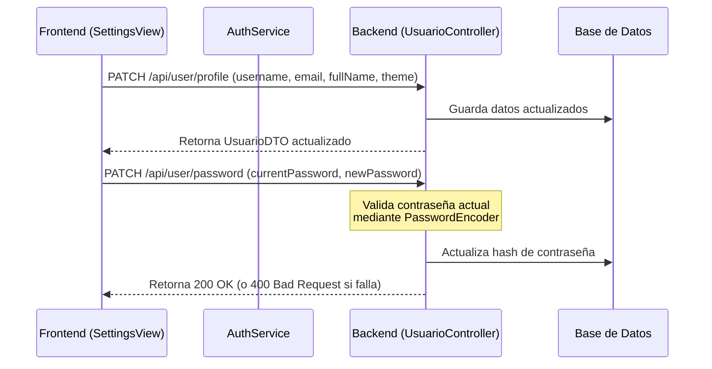

# Plan: Dedicated User Settings Feature

Este plan detalla la implementación de una **Página de Configuración Dedicada (`/settings`)** en el menú de usuario. El desarrollo abarca cambios de lógica de seguridad en el backend (Spring Boot), actualización del modelo de base de datos para temas persistentes, endpoints de limpieza y borrado de cuenta en cascada, y un diseño visual de primer nivel en el frontend.

---

## 🏗️ Resumen de Objetivos

1. **Página Dedicada `/settings`:** Una vista premium estructurada en pestañas laterales o móviles.
2. **Edición de Perfil:** Modificar Nombre Completo, Nombre de Usuario y Correo (con comprobación de disponibilidad en tiempo real).
3. **Cambio de Contraseña Seguro:** Formulario que exige validar la **Contraseña Actual** antes de establecer la nueva.
4. **Preferencias Visuales:** Selector interactivo de temas (Claro / Oscuro / Sistema) guardado y sincronizado de forma persistente en la Base de Datos.
5. **Herramientas de Tareas:**
   - Botón para **limpiar/eliminar tareas completadas** en lote.
   - Botón para **exportar tareas a formato JSON** de forma local.
6. **Zona de Peligro:** Opción para **eliminar cuenta** de forma permanente (con borrado de tareas asociadas en cascada y confirmación de seguridad).
7. **Acceso Rápido en Header:** Añadir un icono de engranaje (`settings` del sprite `main.svg`) en la barra de navegación para acceder a esta página.

---

## 🏗️ Arquitectura y Flujo de Datos



---

## 🛠️ Proposed Changes

### Componente 1: Backend (Spring Boot)

---

#### [MODIFY] [Usuario.java](file:///c:/Users/pablo/OneDrive%20-%20Consejer%C3%ADa%20de%20Educaci%C3%B3n/Clase/Proyecto/todolist/src/main/java/es/educastur/gjv64177/todolist/model/Usuario.java)
Añadir el campo de tema persistente a la entidad JPA.
```java
@Column(nullable = false)
@Builder.Default
private String theme = "SYSTEM";
```

#### [MODIFY] [UsuarioDTO.java](file:///c:/Users/pablo/OneDrive%20-%20Consejer%C3%ADa%20de%20Educaci%C3%B3n/Clase/Proyecto/todolist/src/main/java/es/educastur/gjv64177/todolist/dto/UsuarioDTO.java)
Actualizar el record para exponer el campo del tema en las llamadas a la API.
```java
public record UsuarioDTO (
    String username,
    String role,
    String fullName,
    String email,
    String theme
) {};
```

#### [MODIFY] [UpdateProfileDTO.java](file:///c:/Users/pablo/OneDrive%20-%20Consejer%C3%ADa%20de%20Educaci%C3%B3n/Clase/Proyecto/todolist/src/main/java/es/educastur/gjv64177/todolist/dto/UpdateProfileDTO.java)
Añadir la propiedad del tema en la carga útil de actualización.
```java
public record UpdateProfileDTO(
    String username,
    String fullName,
    String email,
    String theme
) {}
```

#### [NEW] [UpdatePasswordRequest.java](file:///c:/Users/pablo/OneDrive%20-%20Consejer%C3%ADa%20de%20Educaci%C3%B3n/Clase/Proyecto/todolist/src/main/java/es/educastur/gjv64177/todolist/dto/UpdatePasswordRequest.java)
Crear un nuevo record DTO para la petición de cambio de contraseña.
```java
package es.educastur.gjv64177.todolist.dto;

public record UpdatePasswordRequest(
    String currentPassword,
    String newPassword
) {}
```

#### [MODIFY] [UsuarioService.java](file:///c:/Users/pablo/OneDrive%20-%20Consejer%C3%ADa%20de%20Educaci%C3%B3n/Clase/Proyecto/todolist/src/main/java/es/educastur/gjv64177/todolist/Service/UsuarioService.java)
Implementar lógica de cambio de contraseña con validación previa, borrado de cuenta en bloque y actualización del tema.
- Añadir el campo de actualización de `theme` dentro de `updateProfile`.
- Añadir método `updatePassword(String username, String currentPassword, String newPassword)`:
  - Recupera usuario.
  - Compara `passwordEncoder.matches(currentPassword, user.getPassword())`. Si no coincide, lanza `ResponseStatusException(HttpStatus.BAD_REQUEST, "La contraseña actual es incorrecta")`.
  - Encripta y guarda la nueva contraseña.
- Añadir método `deleteUser(String username)`:
  - Llama a `taskService.deleteAllTasksByAuthor(user)`.
  - Elimina el usuario con `usuarioRepository.delete(user)`.

#### [MODIFY] [TaskService.java](file:///c:/Users/pablo/OneDrive%20-%20Consejer%C3%ADa%20de%20Educaci%C3%B3n/Clase/Proyecto/todolist/src/main/java/es/educastur/gjv64177/todolist/Service/TaskService.java)
Añadir los métodos de borrado en cascada y limpieza selectiva:
- `deleteCompletedTasksByAuthor(Usuario autor)`: Obtiene las tareas completadas del autor, las borra, y elimina los tags huérfanos que queden sin asociar.
- `deleteAllTasksByAuthor(Usuario autor)`: Obtiene todas las tareas del autor, las elimina y limpia los tags huérfanos asociados.

#### [MODIFY] [UsuarioController.java](file:///c:/Users/pablo/OneDrive%20-%20Consejer%C3%ADa%20de%20Educaci%C3%B3n/Clase/Proyecto/todolist/src/main/java/es/educastur/gjv64177/todolist/controller/UsuarioController.java)
Añadir los nuevos endpoints de seguridad e información para el usuario logueado:
- `PATCH /api/user/profile`: Actualiza perfil y tema (reutilizando `usuarioService.updateProfile` con el tema).
- `PATCH /api/user/password`: Toma `UpdatePasswordRequest` y llama a `usuarioService.updatePassword`.
- `DELETE /api/user/me`: Llama a `usuarioService.deleteUser` usando el usuario del contexto de autenticación.

#### [MODIFY] [TaskController.java](file:///c:/Users/pablo/OneDrive%20-%20Consejer%C3%ADa%20de%20Educaci%C3%B3n/Clase/Proyecto/todolist/src/main/java/es/educastur/gjv64177/todolist/controller/TaskController.java)
Añadir el endpoint para borrar en lote las tareas completadas:
- `DELETE /api/tasks/completed`: Obtiene el usuario autenticado y llama a `taskService.deleteCompletedTasksByAuthor(user)`.

---

### Componente 2: Frontend (TypeScript & CSS)

---

#### [MODIFY] [api-types.ts](file:///c:/Users/pablo/OneDrive%20-%20Consejer%C3%ADa%20de%20Educaci%C3%B3n/Clase/Proyecto/todolist/frontend/src/types/api-types.ts)
Añadir el campo `theme` a la interfaz de `UsuarioDTO` en TypeScript, y definir la interfaz de `UpdatePasswordRequest`.

#### [MODIFY] [AppHeader.html](file:///c:/Users/pablo/OneDrive%20-%20Consejer%C3%ADa%20de%20Educaci%C3%B3n/Clase/Proyecto/todolist/frontend/src/components/html/AppHeader.html)
Insertar un botón de configuración con el icono de engranaje (SVG ID `#settings`) a la izquierda del botón de Cerrar sesión.
```html
<button id="settings-button" type="button" title="Configuración"
    class="flex items-center justify-center p-2 rounded-xl hover:bg-gray-200 dark:hover:bg-slate-700 text-gray-600 dark:text-gray-400 transition-colors cursor-pointer">
    <svg class="size-6 fill-current">
        <use href="/main.svg#settings"></use>
    </svg>
</button>
```

#### [MODIFY] [AppHeader.ts](file:///c:/Users/pablo/OneDrive%20-%20Consejer%C3%ADa%20de%20Educaci%C3%B3n/Clase/Proyecto/todolist/frontend/src/components/AppHeader.ts)
Vincular el clic del botón de configuración para redirigir a `/settings`:
```typescript
const settingsBtn = this.querySelector('#settings-button') as HTMLButtonElement;
if (settingsBtn) {
    settingsBtn.onclick = () => (window as any).navigate('/settings');
}
```
*Nota: Si el usuario ya está en la vista `/settings`, podemos añadir un estilo activo o resaltar el botón.*

#### [MODIFY] [main.ts](file:///c:/Users/pablo/OneDrive%20-%20Consejer%C3%ADa%20de%20Educaci%C3%B3n/Clase/Proyecto/todolist/frontend/src/main.ts)
Registrar la nueva vista e importarla:
1. Añadir `import './views/SettingsView';`
2. Añadir `/settings` al array de rutas que requieren sesión (`adminPaths` o en la validación de logueados).
3. Añadir la ruta al switch del enrutador:
```typescript
case '/settings':
  app.innerHTML = '<settings-view></settings-view>';
  break;
```

#### [NEW] [SettingsView.html](file:///c:/Users/pablo/OneDrive%20-%20Consejer%C3%ADa%20de%20Educaci%C3%B3n/Clase/Proyecto/todolist/frontend/src/views/html/SettingsView.html)
Maquetación de la página dedicada en pestañas con diseño premium y glassmorphism.
- Estructura de grid lateral: Pestañas a la izquierda (Perfil, Seguridad, Preferencias, Limpieza y Datos, Peligro) y formulario activo a la derecha.
- Animación de cambio de pestaña súper fluida.
- Inputs con estilos focus elegantes y transiciones de sombreado.
- Zona de peligro delineada con un sutil degradado de rojo coral.

#### [NEW] [SettingsView.ts](file:///c:/Users/pablo/OneDrive%20-%20Consejer%C3%ADa%20de%20Educaci%C3%B3n/Clase/Proyecto/todolist/frontend/src/views/SettingsView.ts)
Lógica del Web Component `<settings-view>`:
- **Gestión de Pestañas:** Cambiar el panel visible basándose en el botón seleccionado con animaciones de desvanecimiento ultra-rápidas.
- **Edición de perfil:** Validación inline de nombres y correos disponibles (consumiendo `/api/auth/check-*`), y guardado contra `PATCH /api/user/profile`.
- **Cambio de contraseña:** Lógica para recolectar Contraseña Actual, Nueva y Confirmación, validar coincidencia y llamar a `PATCH /api/user/password` mostrando un Toast flotante de éxito o un mensaje de error detallado del backend.
- **Preferencias:** Tarjetas para seleccionar el tema (Claro / Oscuro / Sistema). Al seleccionar, aplicar clases en `document.documentElement` y llamar a `PATCH /api/user/profile` para guardarlo en la base de datos de forma persistente.
- **Limpieza de Datos:**
  - Botón de limpieza masiva que consume `DELETE /api/tasks/completed` tras mostrar un modal de confirmación premium.
  - Función de exportación a JSON que consume las tareas del caché o del endpoint `GET /api/tasks` y genera un blob de descarga dinámico:
    ```typescript
    const dataStr = "data:text/json;charset=utf-8," + encodeURIComponent(JSON.stringify(tasks, null, 2));
    const dlAnchorElem = document.createElement('a');
    dlAnchorElem.setAttribute("href", dataStr);
    dlAnchorElem.setAttribute("download", "mis-tareas.json");
    dlAnchorElem.click();
    ```
- **Eliminar cuenta:** Desplegar modal que exige escribir el nombre de usuario del cliente para confirmar. Al presionar "Eliminar permanentemente", consume `DELETE /api/user/me`, cierra la sesión llamando a `AuthService.logout()` y redirige a `/login?deleted`.

---

## 🎯 Plan de Verificación (QA)

### Pruebas Automatizadas (Playwright o Unitarias)
- **Cambio de Perfil:** Probar que modificar los datos de perfil actualiza correctamente el estado de sesión del frontend.
- **Contraseña Errónea:** Verificar que al introducir una contraseña actual errónea, el backend retorne un `400 Bad Request` y la UI muestre el aviso rojo de error sin aplicar el cambio.
- **Eliminación Segura:** Simular el borrado de cuenta de un usuario de prueba y comprobar en la base de datos que se han purgado sus tareas y registro sin dejar residuos de foreign keys.

### Verificación Manual
1. Iniciar sesión con un usuario estándar.
2. Hacer clic en el nuevo botón de engranaje en la cabecera.
3. Comprobar que carga la vista de ajustes `/settings` y navegar entre las 5 pestañas laterales.
4. Cambiar el tema y comprobar la persistencia tras refrescar la página.
5. Exportar las tareas a JSON y abrir el archivo descargado para comprobar su estructura.
6. Limpiar las tareas completadas y verificar que desaparecen del tablero principal de Home.
